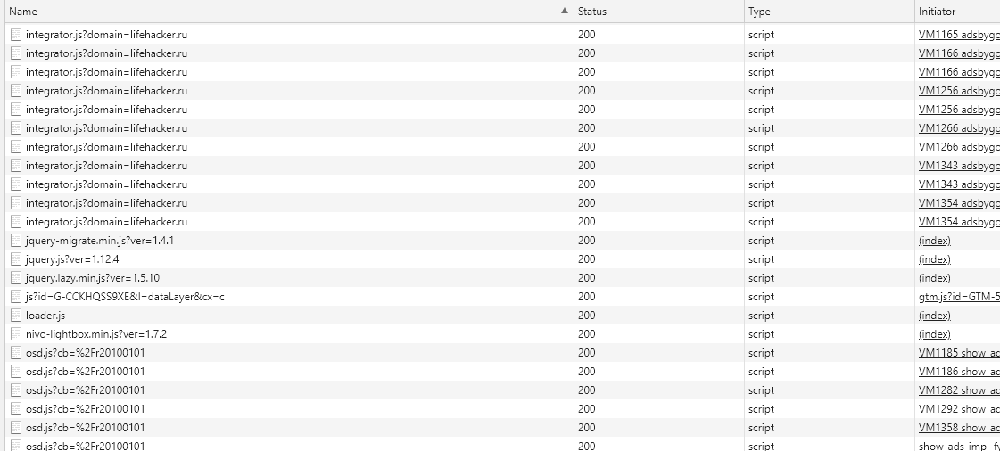
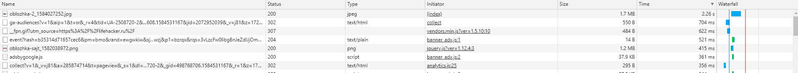
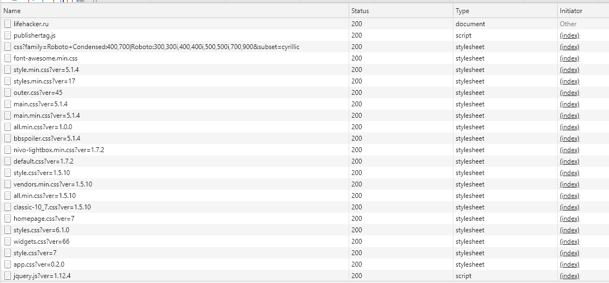
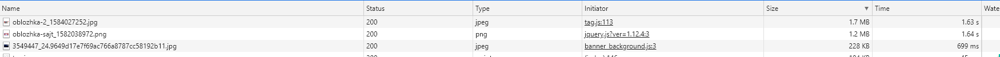
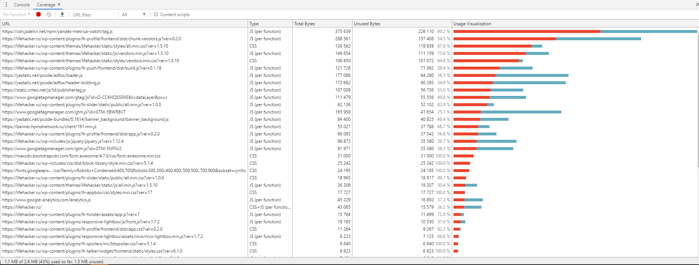

1) Network
	- дублирование ресурсов
	В основном тут запросы рекламы
    
	- медленно загружающиеся картинки
    
	- ресурсы, блокирующие загрузку
	Довольно много css и JS файлов
    
	- Не сжатые картинки
    
2) Performance
	- First Paint: 2262ms
	- First Meaningful Paint: 2862ms
	- DOM Content Loaded: 4103ms
	- Load: 7436ms
	
    
2) Coverage
    
	- Объём неиспользованного CSS: ~387кб
	- Объём неиспользованного JS: ~ 1.1мб